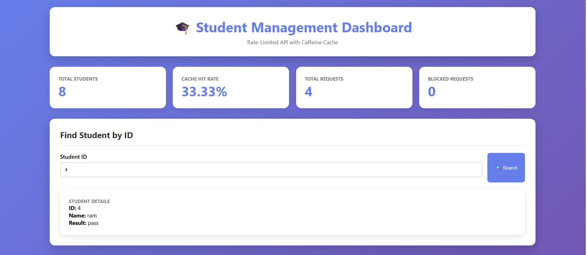
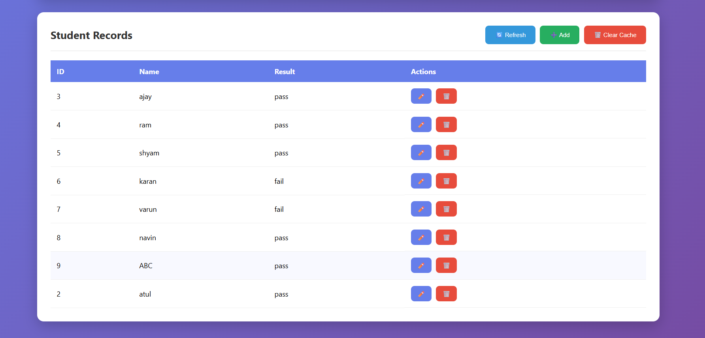

# Student Rate-Limited API with Cache

This project is a **Spring Boot** application that demonstrates a REST API for fetching student records. It integrates the following key components:

- ✅ In-memory caching (using **Caffeine**)  
- ✅ Token Bucket **Rate Limiter**  
- ✅ Spring Data JPA with **H2 in-memory DB**  
- ✅ REST Controller that combines cache-first logic with rate limiting

---

## 📌 Overview

The API flow works like this:

1. **Controller receives request**
2. **Cache is checked first**
   - If found → return response
   - If not → check the rate limiter
3. If request is allowed:
   - Fetch data from DB
   - Store in cache
   - Return response
4. If too many requests → return HTTP `429 Too Many Requests`
5. Cached data expires in **5 minutes**

---

## 📦 API Example
GET /api/1

✅ 200 OK with student data

❌ 429 Too Many Requests (if over the limit)

---

## 🧠 Features

  *Caching	Uses Caffeine, 5-minute expiration*
  
  *Rate Limiting	Token Bucket (5 requests / minute)*
  
  *DB	PostgresSQL*
  
  *RESTful API	Simple GET endpoint*

---

## 🛠️ Technologies Used

  *Spring Boot*
  
  *Spring Data JPA*
  
  *Caffeine Cache*
  
  *PostgresSQL Database*
  
  *Maven*

--- 

## Result 

